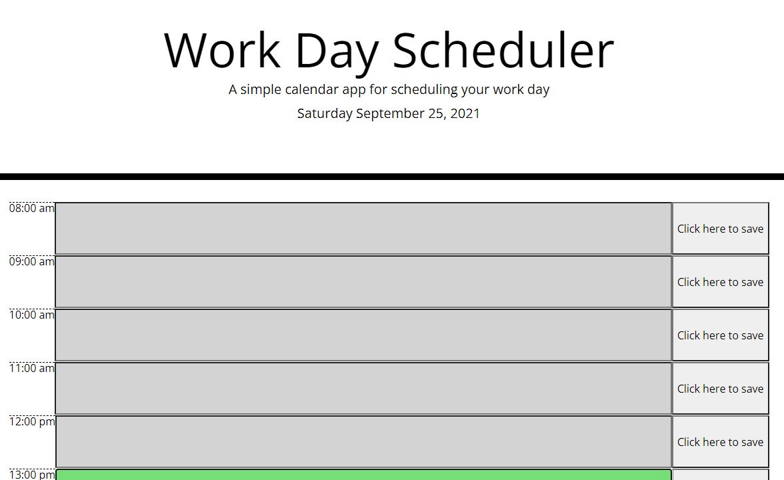

# Work Day Scheduler

This is a work day scheduler page. 

## Usage

The intended use of this page is to enter a task for each hour of the day with the ability to save the task to local storage when the save button is clicked. Each hour should show green for future tasks, red for current, and grey/white for past events. The date at the top of the page should show the current date. 

## Contributions

Mike Horvath 2021

## Screenshot

## Link

https://mhorvy.github.io/work-day-scheduler/